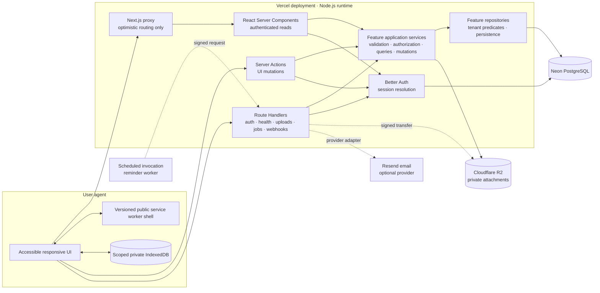
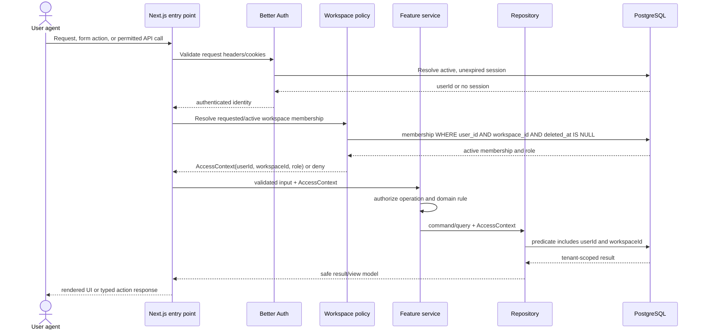

# Daymark architecture

Status: Phase 10 secure optional attachments, accepted locally 2026-08-09.

## System shape

Daymark is one repository, one Next.js 16 application, and one Vercel-compatible deployment. It is a modular monolith: feature modules have enforceable code boundaries, while transactions, authentication, rendering, and deployment stay inside one application until measured operational needs justify a split.



Dashed integrations are external boundaries. The reminder scheduler and email adapter are implemented in Phase 7; optional private R2 attachment storage is implemented in Phase 10.

## Technology baseline

| Concern                     | Selected technology                               | Boundary                                                                      |
| --------------------------- | ------------------------------------------------- | ----------------------------------------------------------------------------- |
| Runtime and package manager | Node.js 24 LTS, pnpm with frozen lockfile         | Pinned by `.node-version`, `engines`, and `packageManager`                    |
| Web application             | Next.js 16 App Router, React 19.2, React Compiler | Server Components by default; client code is opt-in                           |
| Language and styling        | Strict TypeScript, Tailwind CSS 4, shadcn/ui      | Semantic tokens in `globals.css`; owned primitive source in `components/ui`   |
| Motion                      | CSS transitions and semantic motion tokens        | Restrained event feedback only; reduced-motion is mandatory                   |
| Data                        | Neon PostgreSQL, postgres.js, Drizzle ORM/Kit     | Lazy server-only pooled client; reviewed migrations only                      |
| Authentication              | Better Auth                                       | Catch-all auth Route Handler and server-side session validation               |
| Validation                  | Zod                                               | Every user-controlled or external boundary                                    |
| Offline/PWA                 | Serwist Turbopack 9.5.12, IndexedDB via idb 8.0.3 | Public/static worker cache; private data stays in a scoped versioned database |
| Testing                     | Vitest, React Testing Library, Playwright         | Unit/component, repository integration, and journey layers                    |
| Hosting                     | Vercel-compatible                                 | Node runtime; database migration is an explicit release step                  |

All dependencies are exact-pinned. The shadcn initialization necessarily added `class-variance-authority`, `radix-ui`, and the `shadcn` stylesheet package; these support the owned accessible primitive source and are not application state or data-layer abstractions.

## Directory and dependency boundaries

```text
src/
├── app/                 Next.js routes, layouts, states, thin adapters
├── components/
│   └── ui/              owned shadcn primitives; no feature or database imports
├── db/
│   ├── client.ts        lazy server-only postgres.js/Drizzle client
│   └── schema/          Drizzle table declarations
├── features/
│   ├── authentication/
│   ├── workspaces/
│   ├── quests/
│   ├── timer/
│   ├── gates/
│   ├── labels/
│   ├── reminders/
│   ├── offline/
│   ├── attachments/
│   ├── progression/
│   └── activity-events/
├── lib/                 cross-cutting, feature-neutral contracts
└── test/                shared test setup and factories
drizzle/                  generated SQL and schema snapshots
docs/                     architecture and decision records
e2e/                      Playwright journeys
```

Each feature grows into the following internal shape when implemented:

```text
feature/
├── validation/          Zod input schemas and normalized command types
├── authorization/       explicit policies over AccessContext and resources
├── queries/             authenticated read services and view models
├── mutations/           transactional application services
├── repositories/        Drizzle persistence; no presentation logic
├── components/          feature-local rendering and interaction
└── index.ts              deliberate public API only
```

Allowed compile-time dependency direction:

```text
app/components → feature public API → validation/authorization/services
                                      → repositories → db client/schema
shared UI       → components/ui + feature-neutral lib only
```

Forbidden dependencies:

- React components importing `src/db`, a Drizzle table, or a feature repository.
- A repository importing React, Next navigation/cache APIs, or presentation models.
- Authorization decisions embedded in UI visibility alone.
- Cross-feature repository imports; cross-feature behavior uses an application service contract.
- Client modules importing server environment, authentication server, or database modules.
- UI mutations calling duplicate internal REST endpoints.

## Request responsibilities

### React Server Components

Server Components own authenticated application reads. A route resolves a verified session, establishes the active workspace, creates an `AccessContext`, calls feature query services, and maps serializable view models into UI. Query services may use repositories; components may not. Independent reads start in parallel and use Suspense where streaming benefits the user.

### Server Actions

Server Actions are thin adapters for mutations initiated by the product UI. Every action:

1. Resolves and validates the Better Auth session on the server.
2. Validates form or structured input with Zod.
3. Resolves authorized workspace membership into `AccessContext`.
4. Calls one feature mutation service.
5. Returns `ActionResult<T>` for expected failures without raw infrastructure errors.
6. Revalidates only affected paths or tags after commit.

Mutation services re-check authorization and ownership; the action is not a security boundary by itself. Multi-record writes, activity events, progression changes, and idempotency records share a transaction.

### Route Handlers

Route Handlers are limited to Better Auth, `/api/health`, signed attachment upload flows, scheduled reminder invocations, webhooks, and later public/external APIs. They use the same Zod, session/signature validation, application service, and safe-error contracts as Server Actions. UI CRUD does not receive a duplicate Route Handler.

The default runtime is Node.js. Edge runtime requires a written decision covering compatibility and latency need.

## Authentication and workspace authorization flow



Proxy-level cookie checks may improve navigation but never grant access. Secure reads and writes always validate the full session and membership at the server entry point and again at the application-service/repository boundary. See [ADR 003](decisions/003-authentication-and-tenancy.md).

## Cross-cutting rules

- PostgreSQL timestamps are `timestamptz` in UTC; localization happens in presentation code.
- Recoverable user content uses `deleted_at`; immutable activity events are not soft-deleted.
- Mutable aggregates use an integer `version`; updates predicate on the expected version and increment atomically.
- External inputs are Zod-validated and size-limited before service calls.
- Expected failures are stable codes with safe messages. Unexpected failures are logged with a request identifier and shown as a generic message.
- Background jobs and webhooks claim a durable idempotency key before side effects.
- URL search parameters hold shareable filters; local component state holds transient UI state. There is no global client store in the baseline.
- Design and motion decisions are tokenized, AA-contrast checked, keyboard visible, status-text redundant, and reduced-motion aware.

The complete future-repository rule and its narrow provisioning exception are normative in [the AccessContext contract](access-context-contract.md).

## Phase 9 implementation state

Implemented now: Phases 1–7 and the complete MVP. `tasks`, `gates`, `labels`, and `quest_labels` are workspace-scoped; every query and mutation receives `AccessContext`; Gate and Label assignments are server-validated; Subquests are cycle-safe and limited to depth two; and Server Components execute bounded search, filtering, and sorting from validated URL state. Quest ordering is a bounded, workspace-serialized, version-predicated transaction. Create, completion, and reorder interactions update optimistically with explicit rollback, keyboard/touch alternatives, announcements, and reduced-motion feedback.

Phase 7 adds IANA timezone settings, DST-safe RFC recurrence calculation, transactional successor creation, versioned reminder management, in-app notifications, idempotent delivery records, bounded scheduled claiming, capped retries, and a replaceable email provider.

Phase 8 adds a manifest, original install assets, a generated root-scope Serwist worker, network-only protected navigation with a public offline fallback, and an allow-listed static/media cache. Private offline Quest snapshots and create/completion commands live in user/workspace-scoped IndexedDB, never the HTTP cache. Replay uses a same-origin authenticated Route Handler, existing Quest services, mutation UUID idempotency, and `expectedVersion` conflict checks. Phase 9 extends the authorized Quest lifecycle transaction with immutable activity events, an append-only XP ledger, exact corrections, and a rebuildable user progression projection. Phase 10 adds optional private Cloudflare R2 attachment storage: authenticated Server Actions issue bounded staging PUTs and authorized GETs, while server-side inspection, conditional copy, metadata lifecycle, deletion, and a protected cleanup job own trust decisions. Deliberately absent: offline attachments/edits/labels/Gates/order/reminders, push, autonomous closed-app sync, competitive/social progression, social providers, shared-workspace management, and password-reset/email-verification delivery UX.
