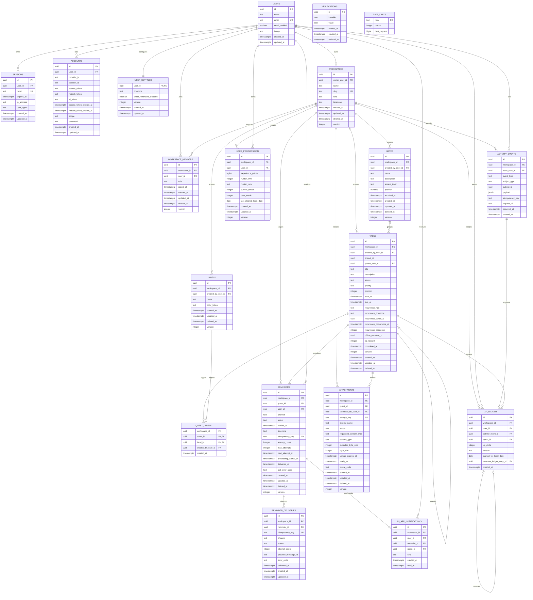

# Data model

Status: Phase 2 implements identity/workspace tables in `0000_tidy_dagger`; Phase 4 adds `tasks` in `0001_melodic_bloodstrike`; Phase 5 adds `gates`, `labels`, and `quest_labels` in `0002_even_moonstone`; audits `0003_abandoned_gamora` and `0004_romantic_the_liberteens` add tenant/search constraints and shared auth rate limits. Phase 7 migration `0005_slippery_exiles` finalizes recurring Quest fields and adds `user_settings`, `reminders`, `reminder_deliveries`, and `in_app_notifications`. Phase 8 migration `0006_serious_proteus` adds a nullable, workspace-unique offline mutation UUID to `tasks` for idempotent replay. Phase 9 migration `0007_friendly_invisible_woman` adds `activity_events`, `xp_ledger`, and the rebuildable `user_progression` projection. Phase 10 migration `0008_aberrant_liz_osborn` adds workspace- and Quest-scoped attachment metadata.

## Conventions

- Primary identifiers are UUIDs generated by Better Auth or PostgreSQL so records remain safe across environments.
- Timestamps are PostgreSQL `timestamptz`, stored and compared in UTC. Date-only user intent, such as a Daily Quest date, is stored as `date` alongside the user's IANA timezone when needed.
- Product-owned mutable rows have `created_at`, `updated_at`, and numeric `version DEFAULT 1`. Better Auth-owned rows follow its pinned adapter contract instead. Product updates use `WHERE id = ? AND version = ?`, then increment `version`.
- Recoverable content and relationships use nullable `deleted_at`; default queries exclude it. Sessions, expired verifications, and immutable events use lifecycle cleanup rather than soft deletion.
- Tenant-owned rows carry `workspace_id`. Repository predicates also include the authenticated `userId` through an active membership join or owner relation.
- User email is normalized by the registration/login boundary. Workspace slugs use a case-insensitive functional/partial unique index rather than an application-only check.
- Enumerated values begin as PostgreSQL text columns with `CHECK` constraints, allowing reviewed expansion without destructive enum migrations.
- JSONB is limited to versioned, non-relational metadata such as activity-event payloads. Core authorization and query fields remain typed columns.

## Full-product ERD

The ERD includes the implemented progression and attachment tables through Phase 10.

`VERIFICATIONS` is keyed by an opaque identifier and therefore has no user foreign key before identity ownership is proven. Better Auth 1.6.26 is the source of truth for the implemented authentication columns; upgrades require a new adapter/schema compatibility review and migration decision.

## Table responsibilities and lifecycle

| Table                     | Responsibility                          | Deletion/lifecycle                                                        |
| ------------------------- | --------------------------------------- | ------------------------------------------------------------------------- |
| `users`                   | Better Auth identity plus user profile  | Better Auth lifecycle; account deletion is not exposed in Phase 2         |
| `sessions`                | Better Auth server-validated sessions   | Hard delete on sign-out/revocation; TTL cleanup by `expires_at`           |
| `accounts`                | Provider/password credentials           | Hard delete with user; secrets encrypted or hashed as applicable          |
| `verifications`           | One-time verification/reset challenges  | Hash token values; hard delete after use or expiry                        |
| `rate_limits`             | Shared authentication abuse buckets     | Better Auth prunes expired windows during limiter writes                  |
| `workspaces`              | Tenant and localization boundary        | Soft delete; owner cannot be removed while workspace is active            |
| `workspace_members`       | Role and active access                  | Soft delete for auditable removal; only one active row per user/workspace |
| `gates`                   | Project-like Quest grouping             | Archive for normal retirement; soft delete for recovery                   |
| `tasks`                   | Implemented Quest aggregate             | Complete via status/time; soft delete and versioned restore               |
| `labels` / `quest_labels` | Workspace taxonomy and assignment       | Soft delete label; transactional assignment removal                       |
| `user_settings`           | User timezone and reminder preferences  | One versioned row per user; cascade with identity deletion                |
| `reminders`               | Durable scheduled-delivery state        | Cancel or soft delete; terminal deliveries retained per policy            |
| `reminder_deliveries`     | Idempotent delivery-attempt ledger      | Retained for deduplication and operational audit                          |
| `in_app_notifications`    | User-visible reminder representation    | Retained with nullable read timestamp                                     |
| `attachments`             | Metadata for separately stored objects  | Two-phase pending/ready/deleting lifecycle and recoverable metadata       |
| `user_progression`        | Per-workspace derived Hunter Rank state | Rebuildable from events; never client-authored                            |
| `activity_events`         | Immutable audit/product event ledger    | Append-only; retention/anonymization policy rather than user deletion     |
| `xp_ledger`               | Auditable XP awards and exact reversals | Append-only; unique event and reversal targets prevent replay duplication |

## Constraints and indexes

At minimum, the Drizzle schema and migration implement:

| Entity          | Constraint/index                                                                                                                                                                                                       |
| --------------- | ---------------------------------------------------------------------------------------------------------------------------------------------------------------------------------------------------------------------- |
| Users           | unique email                                                                                                                                                                                                           |
| Sessions        | unique token; indexes on `user_id` and `expires_at`                                                                                                                                                                    |
| Accounts        | unique `(provider_id, account_id)`; index on `user_id`                                                                                                                                                                 |
| Verifications   | indexes on `identifier` and `expires_at`                                                                                                                                                                               |
| Rate limits     | primary key on the opaque endpoint/client bucket key; atomic count/window updates                                                                                                                                      |
| Workspaces      | unique normalized active slug; one active personal workspace per owner; owner index; kind/version checks                                                                                                               |
| Members         | unique active `(workspace_id, user_id)`; user/workspace indexes; role/version checks                                                                                                                                   |
| Gates           | unique `(id, workspace_id)`; active normalized name uniqueness; indexes on lifecycle and creator                                                                                                                       |
| Tasks/Quests    | unique `(id, workspace_id)`; composite Gate/parent foreign keys; active workspace/status/due/position indexes; unique recurrence series/occurrence; partial trigram title/description indexes; lifecycle/domain checks |
| Labels          | unique `(id, workspace_id)` and active `(workspace_id, lower(name))`; index on workspace                                                                                                                               |
| Quest labels    | primary key `(quest_id, label_id)`; composite Quest/workspace and Label/workspace foreign keys; workspace-label and Quest indexes                                                                                      |
| User settings   | one row per user; positive version and IANA timezone validated at the application boundary                                                                                                                             |
| Reminders       | unique `(id, workspace_id)` and `idempotency_key`; composite Quest/workspace foreign key; due-worker index `(status, next_attempt_at)`; channel/status/attempt/version checks                                          |
| Deliveries      | unique delivery `idempotency_key`; composite reminder/workspace foreign key; status/channel/positive-attempt checks                                                                                                    |
| Notifications   | unique reminder; composite reminder/Quest workspace foreign keys; partial unread user index                                                                                                                            |
| Attachments     | unique storage key; indexes on `(workspace_id, quest_id, deleted_at)` and pending lifecycle age                                                                                                                        |
| Progression     | unique `(workspace_id, user_id)`; XP/rank/level/streak bounds; deliberately no leaderboard index                                                                                                                       |
| Activity events | indexes on `(workspace_id, occurred_at DESC)`, `(workspace_id, subject_type, subject_id)`, and unique non-null `(workspace_id, idempotency_key)`                                                                       |
| XP ledger       | unique activity event and reversed-entry target; composite event/Quest/reversal workspace foreign keys; user/date and Quest indexes                                                                                    |

Foreign keys use restrictive deletion for tenant content by default. Lifecycle services perform explicit, transactional cascades or asynchronous storage cleanup. Authentication-owned ephemeral rows may cascade from `users` when Better Auth compatibility allows it.

## Authorization invariants

1. Every user-owned repository call receives `AccessContext { userId, workspaceId, role }`.
2. Membership is active only when user, workspace, and member rows are not soft-deleted.
3. Tenant queries include `workspace_id = context.workspaceId` and prove the user relation in the same SQL statement or a transaction-locked authorization query.
4. IDs supplied by users never replace the tenant predicate; a cross-tenant ID returns `NOT_FOUND` to avoid resource enumeration.
5. `quest_labels` verifies Quest, Label, and access context share one workspace.
6. Reminder recipient must be an active workspace member at creation; delivery claiming rechecks the active user, membership, workspace, and Quest.
7. Progression is changed only by trusted domain services in the same transaction as the qualifying activity event.
8. Attachment reads and mutations prove active membership and the Quest/workspace relation; cross-tenant identifiers return `NOT_FOUND`.
9. Optimistic conflicts return `CONFLICT` with no silent overwrite.

## Migration impact

Phase 2 adds `drizzle/0000_tidy_dagger.sql` for identity/workspace tables. Phase 4 adds `drizzle/0001_melodic_bloodstrike.sql` for `tasks`. Phase 5 adds `drizzle/0002_even_moonstone.sql` for Gates, Labels, Quest-label relationships, and Gate assignment. Audit migration `drizzle/0003_abandoned_gamora.sql` adds composite tenant foreign keys plus trigram indexes, and `drizzle/0004_romantic_the_liberteens.sql` adds shared auth rate limits. Phase 7 adds `drizzle/0005_slippery_exiles.sql`; its compatible settings backfill copies each user's personal-workspace timezone. Phase 8 adds `drizzle/0006_serious_proteus.sql`. Phase 9 adds `drizzle/0007_friendly_invisible_woman.sql` with no destructive backfill: existing completed Quests retain zero XP until a new eligible server-side lifecycle occurs. Phase 10 adds `drizzle/0008_aberrant_liz_osborn.sql`; it creates attachment metadata only and performs no object-storage backfill. After user data exists, prefer a forward fix or restore rather than dropping content. Production never uses `drizzle-kit push`.
