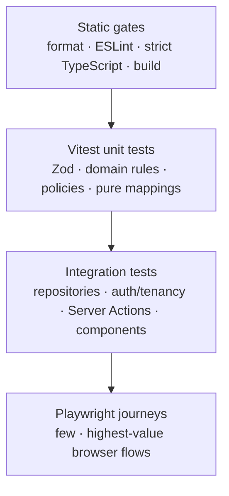

# Testing strategy

The strategy favors many fast domain/validation tests, fewer real-PostgreSQL repository and component integration tests, and a small set of critical Playwright journeys. Tests prove security and behavior at the narrowest reliable boundary; they do not replace database constraints or production observability.

## Test pyramid

## Layers

| Layer                      | Tooling                                                    | What belongs here                                                                                                                        | What does not                         |
| -------------------------- | ---------------------------------------------------------- | ---------------------------------------------------------------------------------------------------------------------------------------- | ------------------------------------- |
| Static                     | Prettier, ESLint, TypeScript, Next build                   | import boundaries, strict typing, RSC/client safety, compilation, production bundling                                                    | runtime/domain confidence             |
| Unit                       | Vitest                                                     | Zod acceptance/rejection, authorization policy matrices, Quest transitions, progression/streak math, reminder eligibility, error mapping | mocked Drizzle query-shape assertions |
| Component                  | React Testing Library + Vitest/jsdom                       | accessible names/roles, keyboard behavior, validation feedback, empty/error/loading states, reduced-motion behavior contracts            | browser layout fidelity               |
| Repository integration     | Vitest + isolated Neon/PostgreSQL test database            | real constraints, indexes where observable, tenant predicates, soft deletion, optimistic concurrency, transactions/idempotency           | replacing repository SQL with mocks   |
| Action/handler integration | Vitest in server environment                               | session/input adapters, typed results, safe errors, signature checks, revalidation decisions                                             | full browser navigation               |
| End-to-end                 | Playwright Chromium, expanding browsers when risk warrants | real sign-up/sign-in, workspace isolation, Quest lifecycle, keyboard critical path, reminder/attachment happy paths                      | exhaustive field combinations         |

Phase 2 adds registration/login/redirect validation, protected proxy behavior, real-PostgreSQL Better Auth and workspace repository integration, production cookie assertions, idempotent personal provisioning, cross-workspace denial, and a full Playwright register→workspace→deny→logout→login journey. Integration tests run when `TEST_DATABASE_URL` is supplied; the release gate must supply it after applying committed migrations.

Phase 3 adds token-contract tests, semantic component tests for navigation and reusable states, confirmation behavior, protected-route coverage for the new shell paths, desktop/mobile navigation journeys, skip-link keyboard focus, reduced-motion verification, and axe-core browser analysis.

Phase 5 adds strict Gate/Label/filter validation, Subquest depth and cycle policy, real-PostgreSQL Gate/Label/placement/assignment/search/filter/sort suites, stale Label-assignment protection, bounded list assertions, and a combined Playwright organisation/discovery journey. Phase 6 adds ordering validation/transactions, keyboard and command controls, optimistic rollback, focus, pointer/mobile, and reduced-motion coverage. Phase 7 adds recurrence/timezone boundaries, successor uniqueness, reminder tenancy, worker authorization, delivery idempotency, retry exhaustion, and provider fakes. Phase 8 adds fake-IndexedDB migration/scope/queue tests, replay handler origin/auth/input/conflict tests, PostgreSQL replay idempotency, and a separate production-worker Playwright project for install, offline read/create/complete, reconnection, and logout clearing. The release suite applies all nine committed migrations before unit/integration, the 10 core Playwright journeys, and the PWA journey.

## Required domain and validation cases

- Quest status transitions: open→cleared, cleared→open, repeated requests, soft-deleted records, and version conflicts.
- Gate archive/restore effects without implicit Quest loss.
- Label name normalization and cross-workspace assignment rejection.
- Workspace owner/admin/member policy matrix, including final-owner protection.
- Daily Quest timezone/date boundary behavior and UTC conversion.
- Progression awards, reversals, rank thresholds, same-day streaks, skipped days, timezone changes, and integer bounds.
- Reminder past/future validation, cancellation, duplicate delivery, retry exhaustion, and privacy-safe payloads.
- Attachment MIME/size/count/checksum/storage-receipt validation and lifecycle transitions.
- Every action schema: minimum/maximum boundaries, unknown fields, malformed UUIDs, invalid timestamps/timezones, and bounded arrays.

## Authorization-sensitive repository suite

Repository integration tests use at least users A/B and workspaces Alpha/Beta. For every user-owned repository operation, assert:

1. A member can perform the allowed operation in Alpha.
2. The same resource ID with Beta context returns no row/no mutation.
3. User B without membership cannot access Alpha.
4. Soft-deleted membership, workspace, parent, or resource blocks access.
5. Supplying a valid ID does not bypass the `userId` and `workspaceId` predicate.
6. Stale `expectedVersion` changes zero rows and maps to `CONFLICT`.
7. A multi-record failure rolls back the aggregate, event, progression, labels, and reminders together.

Tests run against a disposable branch/database or isolated schema, apply committed migrations, and never point at development or production. Each test uses deterministic factories and cleanup/transaction isolation compatible with Neon pooling.

## Critical Playwright journeys by milestone

### Phase 2 identity boundary (implemented)

- Sign up with email/password, receive a session, enter the personal workspace, and sign out.
- Redirect unauthenticated protected navigation and validate the session again at the server boundary.
- Reject a valid but unauthorized workspace UUID, then allow login back into the personal workspace.

### Phase 4 core Quest loop (implemented)

- Unit tests cover strict create/edit/transition validation, real calendar timestamps, schedule order, role policy, and workspace-day boundaries including daylight-saving changes.
- Real-PostgreSQL tests cover CRUD, active/cleared/deleted query views, soft deletion/restoration, stale versions, soft-deleted access, and two-user/two-workspace denial.
- Playwright covers create, Today visibility, edit, optimistic completion, Cleared reopen, delete, restore, and an axe scan through the authenticated Server Action path.

### Phase 5 organisation and discovery (implemented)

- Real-PostgreSQL tests cover Gate lifecycle/deletion rules, Quest assignment, Label lifecycle and multi-label replacement, cross-workspace denial, stale versions, bounded Subquests/cycle refusal, escaped search, every filter family, and database sorting.
- Server query services own all search/filter/sort execution; validation tests prove malformed and repeated URL parameters fall back safely.
- Playwright covers Gate and Label creation, multi-label attachment, Subquest creation, shareable search/Gate/Label filters, reset behavior, Today/Cleared URL filters, Gate deletion guidance, and Gate-filter links.

### Phase 6 interaction and optimistic UX (implemented)

- PostgreSQL tests prove append positions, transactional ordering, stale-version rollback, bounded inputs, and tenant-safe whole-scope validation.
- Playwright covers keyboard-only Quest creation/completion, pointer drag ordering, Alt+Arrow ordering, deliberate stale-version rollback, mobile navigation, command-menu focus restoration, reduced motion, and Arise feedback.
- Component tests cover command filtering/focus and announced optimistic reorder success/failure states.

### Phase 7 recurrence and reminders (implemented)

- Unit tests cover rule normalization, unsupported/high-frequency rules, finite counts, monthly patterns, DST spring gaps and fall offset changes, reminder validation, provider replacement, retries, and duplicate processing.
- Real-PostgreSQL tests cover recurrence successor uniqueness, carried reminder lead time, tenant-safe schedule management, worker membership rechecks, delivery records, notifications, leases, and terminal failure.
- Playwright covers recurrence preview, recurring successor creation, reminder create/edit/cancel, timezone persistence, notifications, focus, and accessibility.

### Phase 8 PWA and offline support (implemented)

- Verify manifest/icon metadata and successful root-scope production worker installation.
- Cache a bounded recent Quest snapshot, reload the public application shell offline, and keep private HTTP responses out of worker caches.
- Queue offline Quest completion and creation, replay both after reconnection, and remove the queue only after an applied result.
- Exercise version conflicts through the handler/storage layers and verify explicit keep-server/retry-latest resolution behavior.
- Log out and prove the private IndexedDB database is gone.

### Phase 10 secure attachments (implemented)

- Unit tests cover strict request bounds and PDF/JPEG/PNG/WebP byte signatures.
- Component tests cover direct-upload progress, successful verification, and
  actionable invalid-file failure without submitting a browser filename.
- Real-PostgreSQL tests use a fake object-storage boundary to cover random
  staging/permanent keys, conditional promotion, cross-workspace read/delete
  denial, invalid and oversized stored objects, authorized download/deletion,
  and abandoned-upload cleanup.

### Gamification

- Clearing eligible Quests updates Hunter Rank once and announces Arise feedback accessibly.
- Reopening/retrying does not double-award; reduced-motion removes the strong visual effect without removing text.

## CI quality gates

CI runs on Node 24 with Corepack and the committed pnpm version:

1. `pnpm install --frozen-lockfile`
2. `pnpm format:check`
3. `pnpm lint`
4. `pnpm typecheck`
5. `pnpm test`
6. Apply migrations to an isolated PostgreSQL target, set `TEST_DATABASE_URL`, and run the repository/auth integration tests.
7. `pnpm build` without a live database connection.
8. Start the production output and run relevant `pnpm test:e2e` projects.
9. Run `pnpm test:pwa` against a production build with service workers enabled.
10. Check migration drift/forward compatibility and scan dependencies/secrets in the hosting CI policy.

A failed gate blocks deployment. Flaky tests are treated as defects: quarantine requires an owner, issue, and deadline, and cannot cover an authorization or data-loss path.

## Test quality rules

- Assert observable behavior and database state, not internal function-call counts unless the call itself is the contract.
- Prefer real Zod schemas and real PostgreSQL repositories; mock only true external boundaries such as email/object storage.
- Use accessible queries (`role`, name, label) before test IDs.
- Freeze/inject time for date, reminder, and progression logic.
- Make timezone and locale explicit.
- Avoid snapshots for large pages; use focused assertions for semantics and state.
- A regression fix starts with a failing test at the closest useful layer.
- Coverage reports guide review but no percentage substitutes for the mandatory case inventory.
